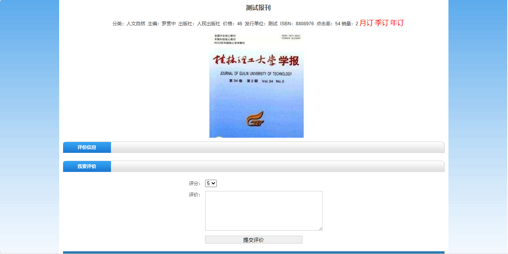
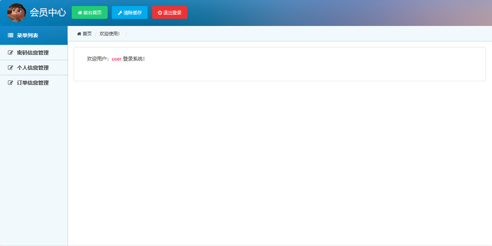
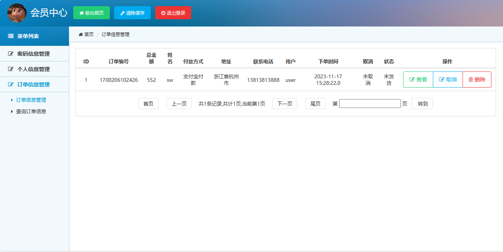
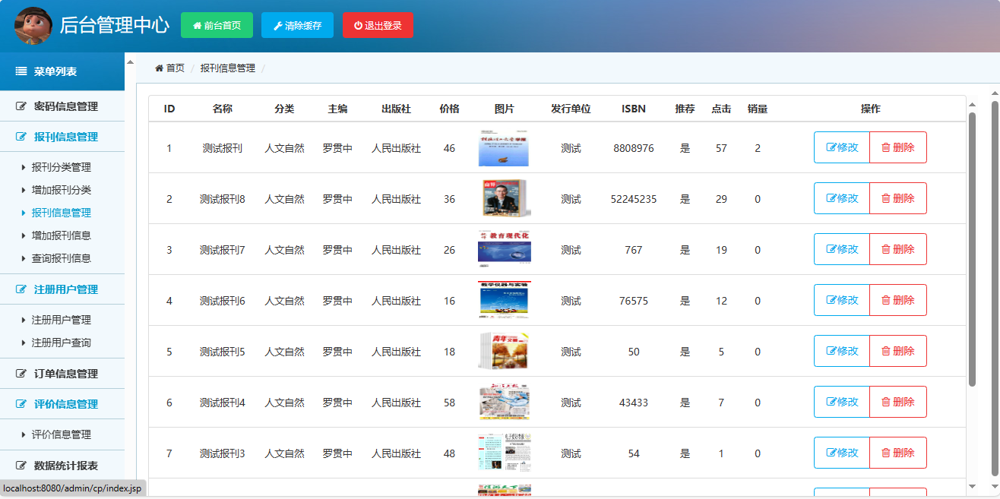

<h1 align="center">报刊征订系统</h1>

- <b>完整代码获取地址：从戎源码网 ([https://armycodes.com/](https://armycodes.com/))</b>
- <b>技术探讨、资料分享，请加QQ群：692619798</b> 
- <b>作者微信：19941326836  QQ：952045282</b> 
- <b>承接计算机毕业设计、Java毕业设计、Python毕业设计、深度学习、机器学习</b>
- <b>选题+开题报告+任务书+程序定制+安装调试+论文+答辩ppt 一条龙服务</b>
- <b>所有选题地址 ([https://github.com/YuLin-Coder/AllProjectCatalog](https://github.com/YuLin-Coder/AllProjectCatalog)) </b>
## 项目介绍

报刊征订系统，前端 Jquery，后端 Servlet、jfreechar，系统分为用户端和管理员端，用户可以访客身份浏览前台页面，用户登录后可以订购期刊；管理员根据用户订单进行发货操作、维护用户信息、查看评价信息、管理期刊信息，主要功能如下：

### 管理员：

- 报刊信息管理：报刊列表、增加报刊分类、修改报刊分类、删除报刊分类、增加报刊信息、修改报刊信息、删除报刊信息、查询报刊信息
- 注册用户管理：注册用户列表、注册用户查询、在用用户操作、停用用户操作、删除用户
- 订单信息管理：根据订单编号搜索订单信息、订单列表、查看订单详情、删除订单信息、订单发货操作
- 评价信息管理：评价信息列表、评价信息删除
- 数据统计报表：输入开始时间和结束时间查询报表信息、金额汇总

### 用户：

- 基本操作：登录、注册、修改密码、退出
- 系统前台：网站首页、报刊信息列表、销量排行、所有分类、报刊查询、报刊月订、报刊季订、报刊年订、购物车、期刊评价
- 会员中心：个人信息修改、个人订单信息管理、订单详情查看、订单取消、根据订单编号搜索订单

## 环境

- <b>IntelliJ IDEA 2021.2</b>
- <b>Mysql 5.7.26</b>
- <b>Navicat  11.1.20.0</b>
- <b>Tomcat 7.0.73</b>
- <b>JDK 1.8</b>

## 运行图

